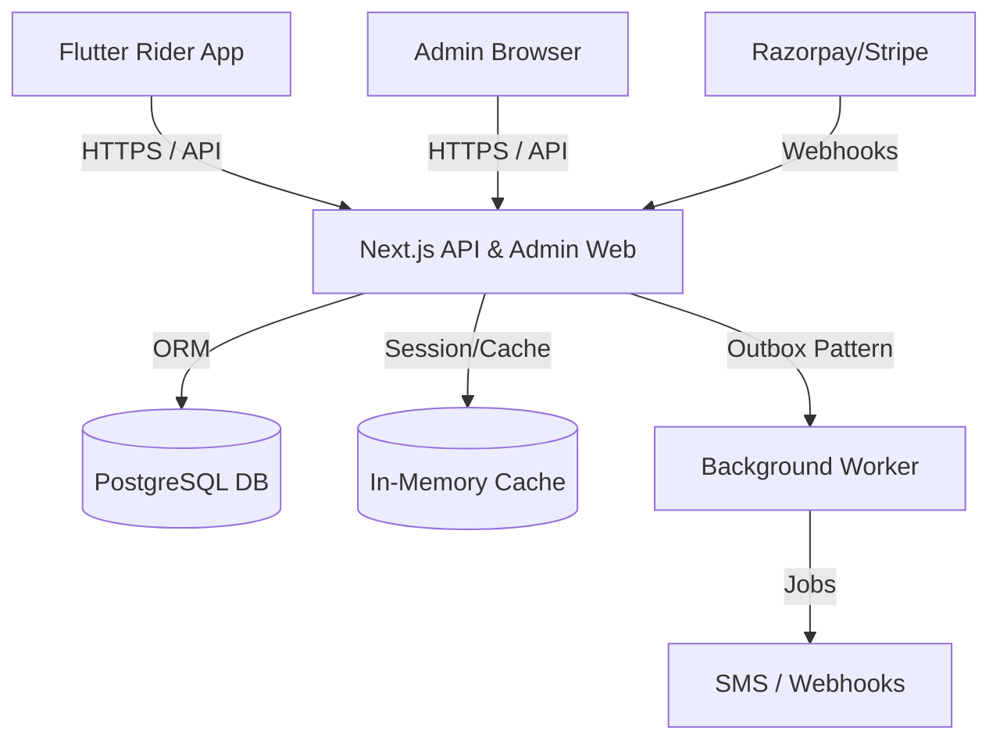

# Voltium ⚡

Voltium is a full-stack, cross-platform electric mobility and vehicle rental management platform. It consists of a robust Node.js/Next.js backend (powering both an administrative web dashboard and an expansive API) and a high-performance Flutter mobile application for riders. Voltium handles the entire vehicle lifecycle—from KYC and security deposits to realtime booking, wallet ledgers, incident tracking, and support ticketing.

---

## 🏛️ Architecture Overview



---

## 🚀 Quick Start (Local Development)

### Prerequisites
- **Node.js**: v20+
- **Flutter**: 3.24+
- **PostgreSQL**: 16+

### 1. Backend Setup
```bash
git clone https://github.com/organization/voltium.git
cd voltium/web

# Install dependencies
npm ci

# Configure environment
cp .env.example .env
# Edit .env with your local PostgreSQL DATABASE_URL

# Run migrations and seed data
npx prisma migrate dev
npm run db:seed

# Start the dev server
npm run dev
```
The API and Admin Dashboard will be available at `http://localhost:8081`.

### 2. Flutter App Setup
```bash
cd voltium/flutter

# Get packages
flutter pub get

# Run on an emulator
flutter run --dart-define=API_URL=http://10.0.2.2:8081
```

---

## 🛠️ Tech Stack

| Component | Technology |
|---|---|
| **Backend Framework** | Next.js 15 (App Router / API Routes) |
| **Language** | TypeScript |
| **Database & ORM** | PostgreSQL 16 + Prisma |
| **Validation** | Zod |
| **Mobile App** | Flutter (Dart 3) + Riverpod |
| **Background Jobs** | Custom Outbox Pattern + PM2 Workers |
| **Authentication** | JWT (HTTP-only cookies) + SMS OTP |

---

## ⌨️ Key Commands (Web)

| Command | Description |
|---|---|
| `npm run dev` | Start development server on port 8081 |
| `npm run build` | Build for production (Standalone) |
| `npm run test:unit` | Run unit tests |
| `npm run test:integration` | Run integration tests (requires dev server) |
| `npm run typecheck` | Run TypeScript validation |
| `npm run lint` | Run ESLint |
| `npm run deploy:staging` | PM2 zero-downtime staging deployment |

---

## 🧪 Testing

We enforce a strict **85% line coverage** requirement on the backend.
- To run the full test suite and check coverage: `npm run test:coverage`
- To run visual golden tests on Flutter: `flutter test --update-goldens`
- End-to-end tests are written in Playwright (`npm run test:e2e`).

See [CONTRIBUTING.md](./CONTRIBUTING.md) for detailed test guidelines.

---

## 🚢 Deployment

Voltium utilizes PM2 for process management and zero-downtime reloads.
- Staging: `npm run deploy:staging`
- Production: `npm run deploy:prod`

Please review the [RUNBOOK](./docs/RUNBOOK.md) and [RELEASE_CHECKLIST](./docs/RELEASE_CHECKLIST.md) before deploying to production.

---

## 🤝 Contributing

We welcome contributions! Please read our [Contributing Guidelines](./CONTRIBUTING.md) to understand our branching model, commit message formatting, and code review checklists.

## 📄 License
Proprietary. All rights reserved.
