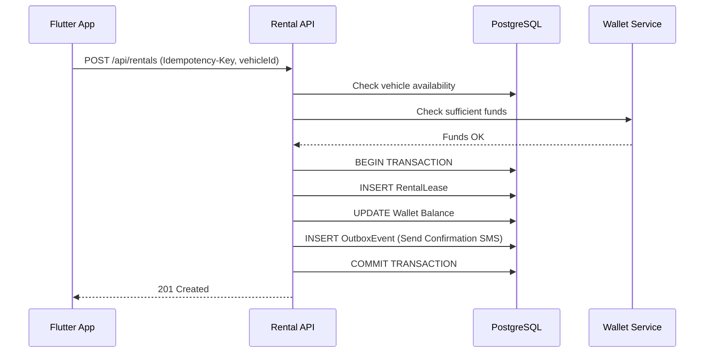

# Voltium Architecture

> [!WARNING]
> **DEPRECATED TOPOLOGY — DO NOT FOLLOW**
> This document describes a legacy architecture (Caddy reverse proxy, Bun bundles, mini-services, and `.zscripts/`) that has been decommissioned.
> As of 2026-09-03:
> - There is NO `.zscripts/`, NO `mini-services/`, NO Bun bundles, and NO Caddy in this repository.
> - Background work runs in-process via `web/src/server/workers/` (PostgreSQL `OutboxEvent` + `lib/job-queue.ts`).
> - `infra/` holds only `grafana/`.
> - For current host orchestration, see `scripts/laptop-service.ps1` and `AGENTS.md`.

This document describes the architectural layout, data flow, and core design patterns of the Voltium platform.

## High-Level Architecture

Voltium follows a modern, distributed monolith architecture with a clear separation of concerns between the frontend (Flutter for Riders, Next.js for Admins) and the backend API (Next.js Route Handlers).

```mermaid
graph TD
    subgraph Client Tier
      Mobile[Flutter iOS/Android App]
      WebAdmin[Next.js Admin Dashboard]
    end

    subgraph API Gateway / CDN
      Caddy[Caddy Reverse Proxy]
    end

    subgraph Backend Application (Next.js)
      API[REST API Routes]
      Workers[Background Job Workers]
    end

    subgraph Data Tier
      Postgres[(PostgreSQL 16)]
      Redis[(Redis Cache)]
    end
    
    subgraph Third Party
      Payment[Razorpay / Stripe]
      SMS[Twilio / Firebase]
    end

    Mobile --> Caddy
    WebAdmin --> Caddy
    Caddy --> API
    API --> Postgres
    API --> Redis
    API -.-> Workers
    Workers --> SMS
    Payment -->|Webhooks| API
```

## Module Map (`web/src/server/modules/`)

The backend follows a Domain-Driven Design (DDD) inspired modular structure. Each module encapsulates its own controllers (routes), use-cases (business logic), and repositories (database access).

- **`auth/`**: SMS OTP generation, verification, and JWT session issuance.
- **`riders/`**: Rider profiles, KYC verification states, and GDPR data deletion.
- **`vehicles/`**: Vehicle inventory, telemetry tracking, and maintenance statuses.
- **`rentals/`**: The core booking engine, handling vehicle leasing and time-tracking.
- **`wallet/`**: Financial ledger for rider balances and security deposits.
- **`webhooks/`**: Ingress for payment provider events.
- **`support/`**: FAQ and ticketing system.

## Key Design Patterns

### 1. The Transactional Outbox Pattern
To prevent dual-write vulnerabilities (e.g., deducting money but failing to send an SMS), all critical side-effects are written to an `OutboxEvent` table in the *same database transaction* as the state change. A background worker continuously polls this table to execute the side-effects safely.
- **See ADR**: [0005: Outbox Pattern](./ADR/0005-outbox-pattern.md)

### 2. Idempotency Keys
For financial mutations (Top-ups, Rentals), clients generate a UUID `Idempotency-Key` header. The backend stores this key upon successful processing. If a network timeout causes a retry, the backend intercepts the identical key and returns the cached success response, preventing double-billing.
- **See ADR**: [0006: Idempotency Keys](./ADR/0006-idempotency-keys.md)

### 3. Role-Based Access Control (RBAC)
Voltium implements a hierarchical RBAC system enforced at the API Middleware layer.
- `RIDER`: Only has access to their own resources.
- `SUPPORT`: Can view tickets and user profiles but cannot mutate finances.
- `ADMIN`: Full access to the platform except sensitive system configurations.
- `SUPER_ADMIN`: Root privileges.

## Data Flow: Vehicle Rental


